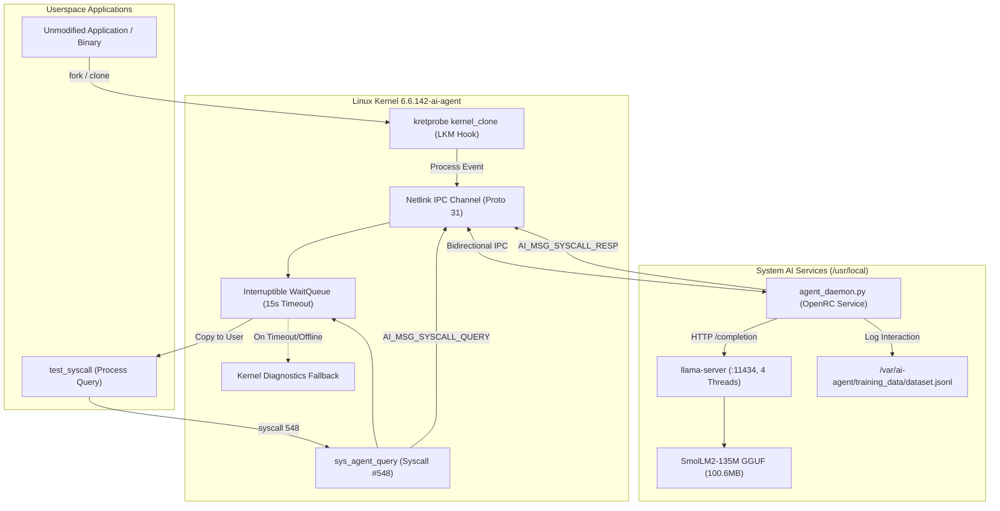

# AI-Agent OS

> An operating system architecture where an AI agent is integrated directly into the Linux kernel and process lifecycle, allowing any process to be observed, understood, and directed without app-level APIs, plugins, or MCP.

[]()
[]()
[-blue.svg)]()
[-orange.svg)]()
[]()

---

## 🌟 The Core Vision

Modern AI assistants integrate with applications via plugins, APIs, or protocols like MCP (Model Context Protocol). This requires every application to be explicitly rewritten or adapted to support AI.

**AI-Agent OS flips this model:**
> **The integration point is the operating system itself, not the application.**

Every process : legacy binaries, CLI tools, services, scripts, containers — must execute system calls through the kernel. By embedding an agent at the OS layer, the system provides:

- **Universal Observability:** Intercept process events and syscall activity without application knowledge.
- **Synchronous Kernel-AI Syscall (`sys_agent_query` #548):** Any program can query the operating system's built-in reasoning engine natively.
- **Self-Contained In-Guest Inference:** Powered by native musl `llama.cpp` and SmolLM2, operating entirely offline with zero host or cloud dependencies.
- **Continuous Telemetry & Fine-Tuning Pipeline:** Every query, latency metric, and verdict is logged to `/var/ai-agent/` in JSONL format for LoRA domain adaptation.

---

## 🏗️ System Architecture



---

## 🚀 Quick Start: Booting the OS Appliance

The system is packaged into a self-contained, bootable QCOW2 disk image: `ai-agent-os-v0.1.qcow2`.

### Requirements

- [QEMU](https://www.qemu.org/) (`qemu-system-x86_64`) installed.
- 4GB RAM available on host.

### One-Command Boot

**Windows (PowerShell):**

```powershell
.\boot.ps1
```

**Linux / macOS (Bash):**

```bash
chmod +x boot.sh
./boot.sh
```

The system automatically initializes:

1. Boots `Linux 6.6.142-ai-agent` directly via Syslinux.
2. Starts native `llama-server` on `127.0.0.1:11434`.
3. Starts `agent_daemon.py` and registers PID with the kernel.
4. Starts `sshd` and forwards SSH to `localhost:2222`.

### Accessing the Guest

- **SSH:** `ssh -p 2222 root@127.0.0.1`
- **Web / API:** `http://127.0.0.1:11434/health` inside the guest.

---

## 🧪 Automated Boot & System Verification

The system includes an automated test harness that exercises all layers of the OS stack:

```bash
/root/os-ai-agent/test_phase6_boot.sh
```

### Verification Output

```
==================================================
    AI-Agent OS: Phase 6 Boot Validation Harness  
==================================================
[PASS] Running custom kernel: 6.6.142-ai-agent
[PASS] llama-server and llama-cli installed in /usr/local/bin
[PASS] All dynamic library dependencies resolved for llama-server
[PASS] GGUF model present at /var/lib/ai-agent/models/smollm2-135m-instruct-q4_k_m.gguf (size: 100.6M)
[PASS] agent_daemon.py installed and executable at /usr/local/lib/ai-agent/agent_daemon.py
[PASS] llama-server registered in default runlevel
[PASS] ai-agent registered in default runlevel
[PASS] sshd registered in default runlevel
[PASS] llama-server /health returned healthy status
[PASS] Kernel confirmed daemon registration in dmesg
[PASS] syscall(548) successfully routed to LLM and returned response in 4434.92 ms
[PASS] All kernel edge-case validations passed (NULL pointers, invalid memory)
[PASS] Dataset exists at /var/ai-agent/training_data/dataset.jsonl with 18 records

==================================================
           Phase 6 Boot Validation Summary        
==================================================
  Total Passed: 13
  Total Failed: 0
  Warnings:     0
  RESULT: ALL PHASE 6 BOOT VALIDATIONS PASSED! [SUCCESS]
==================================================
```

---

## 🛠️ Invoking the Syscall from C

Any userspace program can query the operating system agent directly:

```c
#include <stdio.h>
#include <unistd.h>
#include <sys/syscall.h>

#define SYS_AGENT_QUERY 548

int main(void) {
    char response[512] = {0};
    const char *query = "Checking process safety and resource state.";

    long ret = syscall(SYS_AGENT_QUERY, 0 /* target PID */, query, strlen(query), response, sizeof(response));
    if (ret >= 0) {
        printf("Kernel AI Agent Verdict: %s\n", response);
    } else {
        perror("sys_agent_query failed");
    }
    return 0;
}
```

---

## 📁 Repository Structure

```
os-ai-agent/
├── agent-daemon/                 # Userspace Agent Daemon & Services
│   ├── agent_daemon.py           # Unified Netlink daemon (Process events + Syscall #548)
│   ├── logger.py                 # Telemetry & JSONL fine-tuning dataset logger
│   └── openrc/                   # OpenRC service scripts
│       ├── llama-server          # Native musl inference server service
│       └── ai-agent              # Unified agent daemon service
├── custom-kernel/                # Custom Linux Kernel Source & Headers
│   ├── kernel/ai_agent.c         # sys_agent_query (#548) implementation
│   └── include/uapi/linux/ai_agent.h # UAPI syscall & Netlink definitions
├── kernel-module/                # Loadable Kernel Module (LKM)
│   └── ai_process_hook.c         # kretprobe hook on kernel_clone
├── ptrace-monitor/               # Phase 1 Userspace Monitor
│   └── monitor.c                 # ptrace-based syscall interceptor
├── agent-cli/                    # Phase 8 Intent CLI
│   ├── agent-cli.c               # Invokes Syscall #548 to dispatch JSON intents
│   └── Makefile
├── test-programs/                # Syscall Validation Programs
│   ├── test_syscall.c            # Single-process & edge-case test
│   └── test_syscall_stress.c     # Multi-threaded concurrent stress test
├── boot.ps1                      # Windows PowerShell one-command boot launcher
├── boot.sh                       # Linux / macOS Bash one-command boot launcher
├── test_phase6_boot.sh           # Phase 6 automated verification harness
├── AI_Agent_OS_Technical_Documentation.md # Exhaustive technical architecture & reference
└── README.md
```

---

## 🤝 Contributing & Security Vulnerabilities

Since this project introduces deep, kernel-level changes (such as custom system calls and Netlink IPC hooks), there is a potential for security vulnerabilities or stability issues that we might have missed during initial development.

We highly encourage the open-source community to review the code, look out for potential exploits, memory leaks, or race conditions, and contribute patches.

If you discover a security vulnerability:

- Please open an issue in the repository with a detailed reproduction case.
- Alternatively, you can email me directly to report sensitive security issues before they are publicly disclosed.

All contributions, whether they are security fixes, performance improvements, or documentation updates, are welcome!

---

## 📜 Roadmap & Milestone Summary

| Phase | Milestone | Status |
| --- | --- | --- |
| **Phase 1** | Userspace `ptrace` syscall monitor | ✅ Validated |
| **Phase 2** | LLM syscall explanation & analysis pipeline | ✅ Validated |
| **Phase 3** | LKM `kernel_clone` hook + Netlink IPC (Proto 31) | ✅ Validated |
| **Phase 4** | Custom kernel `6.6.142-ai-agent` + `sys_agent_query` (#548) | ✅ Validated |
| **Phase 5** | In-guest native musl `llama.cpp` + SmolLM2-135M | ✅ Validated |
| **Phase 6** | Self-contained compressed OS appliance image (`ai-agent-os-v0.1.qcow2`) | ✅ Validated |
| **Phase 7** | OS Agent Fine-Tuning (LoRA) — The OS continuously learns from its own `.jsonl` logs | ✅ Validated |
| **Phase 8** | Intent-Driven Execution (Orchestrator OS) — Automatic task delegation via sub-processes | ✅ Validated |

---

## 📖 Complete Documentation

For the comprehensive design document, threat modeling, kernel internals, and benchmarking details, see:  
👉 **[AI_Agent_OS_Technical_Documentation.md](AI_Agent_OS_Technical_Documentation.md)**
